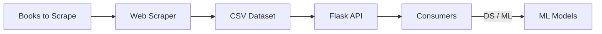

# Book Sommelier API

A simple public API built with **Python, Flask, and Web Scraping**.
The project extracts book data from *books.toscrape.com*, stores it locally, and exposes it via a REST API ready for **data science and machine learning use cases**.

---

## Project Goals

* Build a **web scraping pipeline** to collect book data
* Store data in a reusable format (CSV)
* Expose data through a **RESTful API (Flask)**
* Prepare the foundation for **future ML pipelines**

---

## Architecture Overview



**Pipeline:** Ingestion → Processing → API → Consumption

---

## 📂 Project Structure

```text
.
├── api/
│   ├── routes.py        # API endpoints
│   └── app.py           # Flask app factory
│
├── scripts/
│   └── scraper.py       # Web scraping logic
│
├── data/
│   └── books.csv        # Scraped dataset
│
├── requirements.txt
├── run.py               # App entrypoint
└── README.md
```

---

## ⚙️ Installation

```bash
# Clone repository
git clone git@github.com:ebarros29/book-sommelier-api.git
cd book-sommelier-api

# Create virtual environment
python -m venv venv
source venv/bin/activate

# Install dependencies
pip install -r requirements.txt
```

---

## 🕷️ Run Web Scraping

```bash
python3 scripts/scraper.py
```

This will generate/update:

```
data/books.csv
```

---

## Run the API

```bash
python3 app.py
```

API will be available at:

```
http://localhost:5000
```

---

## 🔌 API Endpoints

### Core Endpoints

| Method | Endpoint               | Description              |
| ------ | ---------------------- | ------------------------ |
| GET    | `/api/v1/books`        | List all books           |
| GET    | `/api/v1/books/<id>`   | Book details by ID       |
| GET    | `/api/v1/books/search` | Search by title/category |
| GET    | `/api/v1/categories`   | List categories          |
| GET    | `/api/v1/health`       | API health check         |

### Example

```http
GET /api/v1/books/search?category=Travel
```

Response:

```json
{
  "id": 12,
  "title": "It's Only the Himalayas",
  "price": 45.17,
  "rating": 2,
  "availability": "In stock",
  "category": "Travel"
}
```

---

## ML-Ready Vision

The API was designed to support future ML workflows:

* Feature extraction endpoints
* Training dataset generation
* Recommendation & prediction services

---

## 🌍 Deployment

TBD

---

## Tech Stack

* Python
* Flask
* Requests
